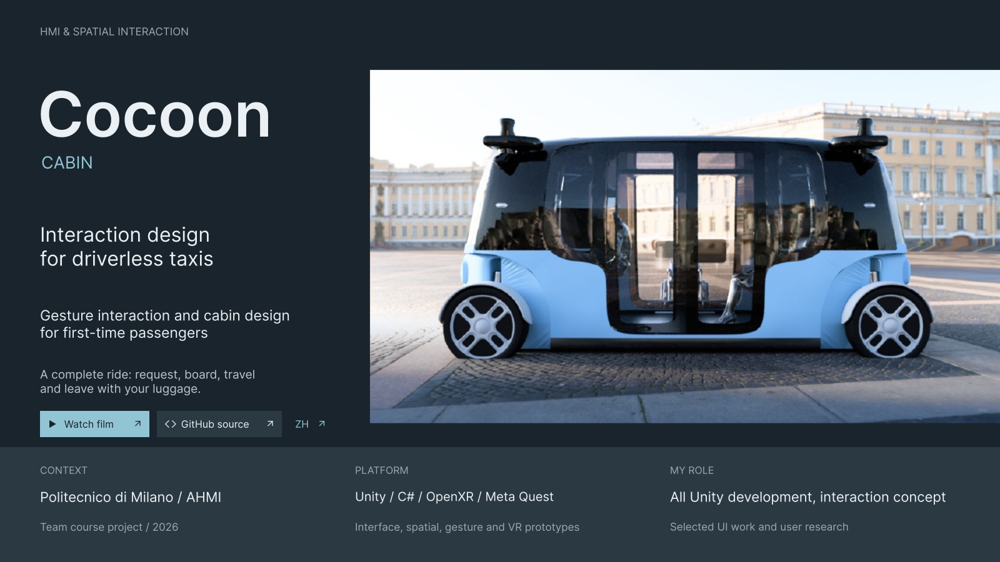
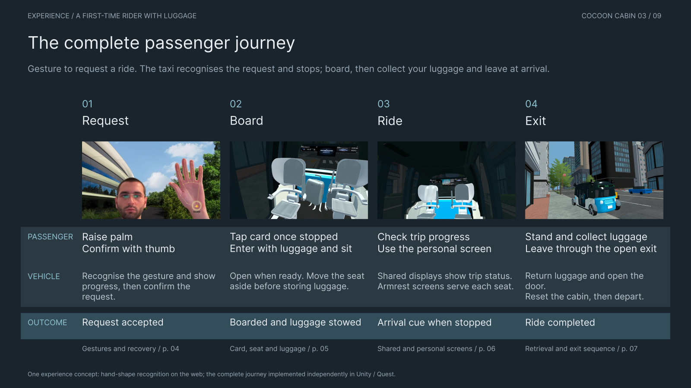
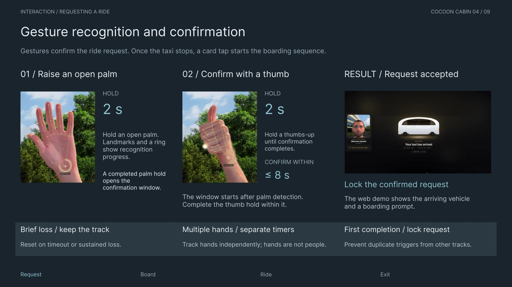
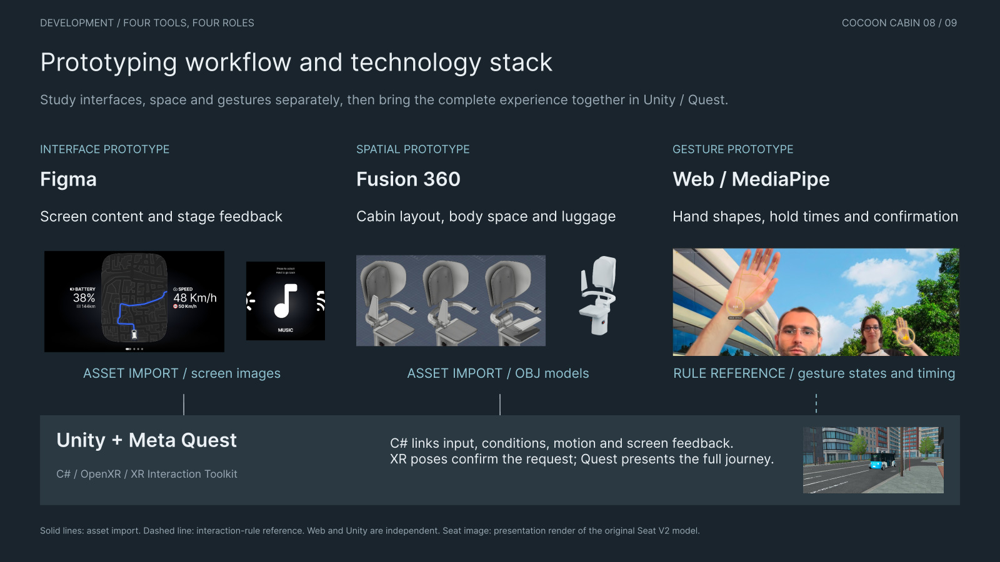

<p align="center">
  
</p>

<p>
  <a href="https://youtu.be/s00BhWtERXI"><strong>Watch the English film ↗</strong></a> &nbsp;·&nbsp;
  <a href="https://youtu.be/bH3W_9BMuKw">中文视频 ↗</a> &nbsp;·&nbsp;
  <a href="docs/portfolio/Cocoon-Cabin-Portfolio-EN.pdf">English portfolio PDF</a> &nbsp;·&nbsp;
  <a href="docs/portfolio/README.md">Nine-page case study</a> &nbsp;·&nbsp;
  <a href="docs/portfolio/Cocoon-Cabin-Figma-EN.zip">Editable SVGs</a>
</p>

# Cocoon Cabin

**Interaction design for driverless taxis.**

Cocoon Cabin explores the first encounter with a robotaxi: being recognised, confirming a request, entering with luggage, understanding the cabin and leaving at the destination. The project connects gesture interaction, physical space and screen feedback in an experience that can be explored in VR.

Developed for **Advanced Human-Machine Interfaces at Politecnico di Milano**, 2026.

**Yuchen Zhang's contribution:** all Unity development, the interaction concept, selected UI work and user research. Research, cabin design, interface design and the web gesture prototype are team outcomes.

`Unity 2022.3.53f1` · `C#` · `OpenXR` · `XR Interaction Toolkit` · `Meta Quest`

## Watch the project

<a href="https://youtu.be/s00BhWtERXI"></a>

[English film](https://youtu.be/s00BhWtERXI) · [Chinese film](https://youtu.be/bH3W_9BMuKw)

## One connected passenger journey

The prototype focuses on a **first-time passenger carrying luggage**. Each transition combines a passenger action, a vehicle response and a visible outcome.

| Stage | Passenger action | Vehicle response |
| --- | --- | --- |
| **01 / Request** | Raise a hand and confirm the request. | Show recognition progress and a confirmed request. |
| **02 / Board** | Tap the card after the taxi stops; enter with luggage. | Prepare the ramp, open the door, move the seat aside and stow luggage. |
| **03 / Ride** | Sit down and follow the journey. | Show trip information on the shared display and personal content near the seat. |
| **04 / Exit** | Stand, collect luggage and leave. | Return luggage, open the exit, then reset the cabin and depart after a timed wait. |



## Why these interactions?

Exploratory interviews and three qualitative journey maps examined getting home late, arriving with luggage and booking a ride for someone else. The team prioritised opportunities in seven categories using gold, silver and bronze votes, weighted **3 / 2 / 1**.

This led to three design priorities:

- **Explicit confirmation:** distinguish being detected from committing to a ride, and show the result.
- **Sequenced automation:** coordinate the card, ramp, door, seat and luggage through clear prerequisites.
- **Visible progress:** explain the current journey stage and arrival through shared and personal displays.

The journey curves are qualitative summaries. The voting weights are prioritisation rules, not participant counts or measured usability scores. [Read the research page →](docs/portfolio/pages/02-research.jpg)

## Gesture interaction

The team's [web prototype](https://github.com/MoeMaelGit/AHMI_HandGesture_Demo_00) uses MediaPipe landmarks and geometric hand-shape rules. An open palm initiates a request; a thumbs-up confirms it.

**Palm hold: 2 s → confirmation window: up to 8 s → thumb hold: 2 s → request locked.**

Each hand track maintains its own state and timer. Brief tracking loss can be tolerated; timeout or sustained loss resets the attempt. The first completed confirmation locks the request to prevent duplicate triggers.



**The web and VR implementations are separate.** The Unity prototype uses tracked XR hand/controller poses: a 2-second raised-hand hold followed by a 3-second pose confirmation. It does not run the web hand-shape classifier or receive its events through a live bridge. This separation lets the web prototype study recognition while VR studies the complete spatial experience.

## Prototyping workflow

| Tool | What it investigates | How it informs the VR experience |
| --- | --- | --- |
| **Figma** | Screen content, hierarchy and feedback across service stages. | Screen images imported as textures. |
| **Fusion 360** | Cabin layout, reach, visibility and space for bodies and luggage. | Models imported as OBJ assets. |
| **Web / MediaPipe** | Hand-shape recognition, holds, confirmation and recovery. | Interaction rules inform the independent XR implementation. |
| **Unity + Meta Quest** | Whether the journey holds together from the street to the seat and back. | C# coordinates input, state, spatial actions and feedback. |



## Inside the Unity prototype

The main scene is [`Cocoon_OnboardingVR.unity`](Assets/Scenes/Cocoon_OnboardingVR.unity). The runtime scripts are in [`Assets/CocoonPrototype/Scripts`](Assets/CocoonPrototype/Scripts).

| System | Responsibility |
| --- | --- |
| [`CocoonTaxiStateMachine`](Assets/CocoonPrototype/Scripts/CocoonTaxiStateMachine.cs) | Ride stages, confirmation, card contact, boarding conditions, seating and destination exit. |
| [`CocoonRaiseHandDetector`](Assets/CocoonPrototype/Scripts/CocoonRaiseHandDetector.cs) | XR pose hold, facing, distance and vehicle-approach conditions. |
| [`CocoonSeatV2Controller`](Assets/CocoonPrototype/Scripts/CocoonSeatV2Controller.cs) | Whole-seat movement between authored positions. |
| [`CocoonLuggageFollower`](Assets/CocoonPrototype/Scripts/CocoonLuggageFollower.cs) | Passenger luggage handling; the state machine coordinates storage and return paths. |
| [`CocoonCabinScreenController`](Assets/CocoonPrototype/Scripts/CocoonCabinScreenController.cs) | Screen-image sequences tied to boarding, seating, travel and arrival. |
| [`CocoonLightSequenceController`](Assets/CocoonPrototype/Scripts/CocoonLightSequenceController.cs) | Spatial guidance and luggage-area light feedback. |
| [`CocoonRoadGraph`](Assets/CocoonPrototype/Scripts/CocoonRoadGraph.cs) | Authored road connectivity for the simulated vehicle journey. |

[Architecture and scene guide](docs/architecture.md) · [Interaction details](docs/interaction.md)

## Open the project

**Requirements:** Unity **2022.3.53f1**, Git LFS, Android Build Support for Quest builds, and a separately licensed copy of **Japanese City by KraftMaru** for the recorded streetscape. The external environment package is excluded from this public repository; its scene references are preserved. See [asset setup and attribution](docs/third-party-assets.md).

```bash
git lfs install
git clone --branch main --single-branch https://github.com/Acerinka/Cocoon-Cabin.git
cd Cocoon-Cabin
git lfs pull
```

1. Add this folder in Unity Hub and open it with **2022.3.53f1**.
2. Let Package Manager restore the pinned dependencies. Import your licensed, Unity-2022-compatible Japanese City package at `Assets/JapaneseCity` before running the authored scene.
3. Open `Assets/Scenes/Cocoon_OnboardingVR.unity`.
4. For a headset build, install Android SDK/NDK and OpenJDK through Unity Hub, select Android and review **XR Plug-in Management → OpenXR** validation.
5. Use **Cocoon → Build Quest APK** for the project's development build, or configure a build through Unity's Build Settings.

Use a Git clone with LFS for the Unity project. GitHub's source ZIP may contain model/image pointers instead of the large assets.

### Quest controls

| Input | Action |
| --- | --- |
| Raise a tracked hand/controller toward the approaching taxi | Hold to request and confirm; follow the on-screen progress. |
| Right-hand virtual card | Touch the card to the door-side reader once stopped. |
| Left grip | Handle luggage. |
| Left stick | Move while locomotion is enabled. |
| Right stick | Snap turn. |
| Left trigger | Aim and release teleport. |
| Right **A** | Sit or stand when the current stage allows it; reset after a completed drop-off. |
| Right **B** while seated | Request the destination drop-off sequence. |

[Setup, desktop shortcuts and troubleshooting →](docs/setup.md) · [Publication checks](docs/verification.md)

## Portfolio files

The **nine-page English case study** reflects the revised Chinese portfolio: design research, the complete journey, gesture confirmation, boarding, in-cabin interfaces, exit, prototyping workflow and Unity outcomes.

- [English PDF](docs/portfolio/Cocoon-Cabin-Portfolio-EN.pdf) — searchable text, embedded imagery and clickable GitHub / English-film / Chinese-film links on the cover.
- [Read all nine pages](docs/portfolio/README.md) — rendered pages for browsing on GitHub.
- [Figma SVG package](docs/portfolio/Cocoon-Cabin-Figma-EN.zip) — nine **2560 × 1440 SVGs**, each containing a **3840 × 2160 PNG** background with editable text above it. Uses Inter Regular and SemiBold.

## Scope and evidence

This is an academic interaction-design and VR prototype. Videos document the demonstrated experience. Source code explains how that experience is coordinated.

The vehicle follows an authored simulation; this is not a real autonomous-driving stack. The card is a virtual contact interaction, not a payment or identity backend. Cabin controls are represented through stage-based screen images. The exit sequence uses a preset wait rather than confirmed passenger-exit sensing. Research materials do not establish quantified trust, safety or usability improvements.

## Team and credits

**Duygu Can · Vincenzo Lomuscio · Ma-El-Ainin Mohammad Oussama · Huiyu Yang · Yuchen Zhang**  
AHMI, Group 6, Politecnico di Milano, 2026.

Yuchen Zhang developed the Unity prototype and contributed the interaction concept, selected UI work and user research. The cabin design, research, UI and web prototype are presented as team work. The [gesture repository](https://github.com/MoeMaelGit/AHMI_HandGesture_Demo_00) retains its original authorship and history.

The [MIT license](LICENSE) applies to the original project code. It does not relicense third-party software, models, interface artwork or portfolio media. See [asset and license notes](docs/third-party-assets.md).
