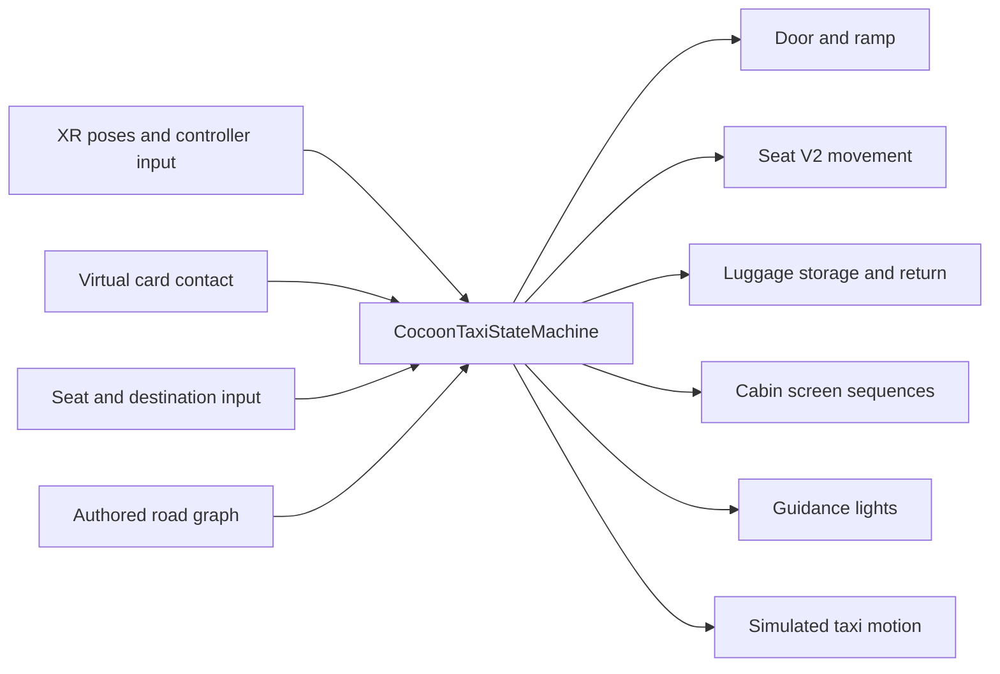

# Unity architecture

The prototype coordinates a passenger journey through C# state and authored spatial references. The main scene is `Assets/Scenes/Cocoon_OnboardingVR.unity`.

## Runtime responsibilities



The web gesture application is independent and is deliberately absent from this runtime diagram.

| Module | Main responsibility | Important constraint |
| --- | --- | --- |
| `CocoonTaxiStateMachine` | High-level stages, entry gating, luggage and seat sequences, travel and exit. | Later actions wait for earlier stage conditions. |
| `CocoonRaiseHandDetector` | Raised-hand pose, hold duration, facing, distance and approach checks. | Pose detection is not palm/thumb image classification. |
| `CocoonSeatV2Controller` | Seat movement to authored out/back targets. | The current sequence translates the whole seat. |
| `CocoonLuggageFollower` | Luggage handling around the rider. | Storage/return timing is coordinated by the state machine. |
| `CocoonCabinScreenController` | Main, side and mini-screen image sequences. | Screens display staged content, not a connected vehicle backend. |
| `CocoonLightSequenceController` | Spatial and luggage-area cues. | Runtime proxy lights visualise the sequence. |
| `CocoonRoadGraph`, traffic scripts | Road connectivity, simulated traffic and drop-off movement. | Authored route simulation, not autonomous perception or planning. |
| `CocoonVRLocomotion`, XR helpers | Movement, snap turn, teleport and tracked poses. | Movement availability follows the ride stage. |

## Scene organisation

| Root | Contents |
| --- | --- |
| `00_Runtime` | XR rig, input and runtime coordination. |
| `01_Lighting` | Scene lighting. |
| `ROADMAP` | Authored road network. |
| `02_Street_Block` | Streetscape and environment references. |
| `03_Traffic` | Simulated traffic. |
| `04_Cocoon_Taxi` | Vehicle model, entry, seats and luggage mechanisms. |
| `05_Pickup_Guidance` | Pickup-related spatial cues. |
| `06_UI` | Screen content and destination marker. |

Hand-authored transforms matter. Rebuilding a vehicle or recentering imported geometry can break the relationships among the card reader, ramp, seat, luggage path and screen planes.

## Key spatial references

- **Door-side card reader:** the right-hand virtual card must overlap the `DOORUI` region. Head, body or a generic hand overlap is not the card confirmation.
- **Seat V2:** the assembly moves between authored clearance and seated positions. Screens and the seated head anchor follow the seat.
- **Luggage:** storage follows the scene's `bagA1` through `bagA3` waypoints; retrieval reverses the sequence in the taxi's coordinate frame. Seat clearance precedes storage.
- **Screens:** imported screen planes preserve their hand-authored placement. The runtime swaps image textures with the ride stage.
- **Destination:** the destination marker is interpreted through the authored road graph and stopping behaviour, not a direct straight-line drive across the scene.

## Repository layout

```text
Assets/
  CocoonPrototype/       Runtime scripts, editor tools, materials, screen resources
  ImportedAssets/        Vehicle, seat, luggage and wheelchair models
  Scenes/                Authored onboarding / ride scene
  XR/ and XRI/           XR configuration
Packages/                Pinned Unity dependencies
ProjectSettings/         Project and build settings
docs/                    Setup, interaction, credits and English portfolio
Tools/                   Project utilities and repository verification
```

`Assets/JapaneseCity` is a local external dependency and is intentionally ignored. Unity caches, recordings, generated builds and portfolio production intermediates are not part of the public source snapshot.
