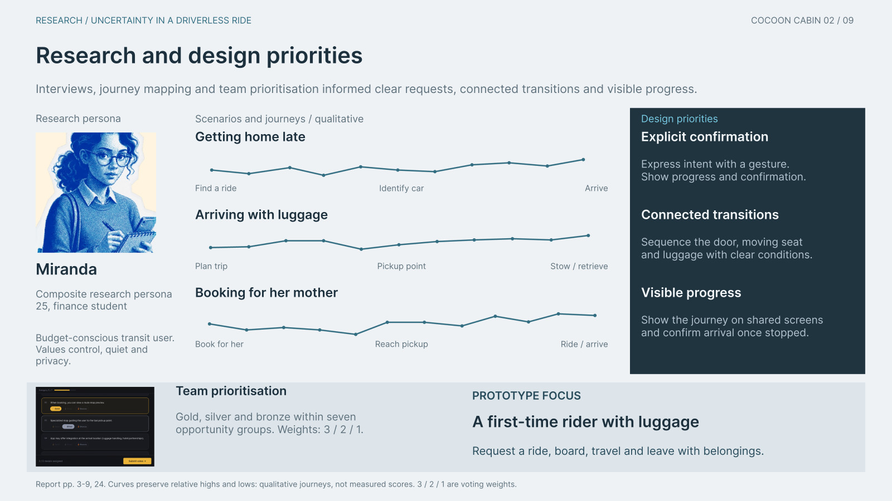
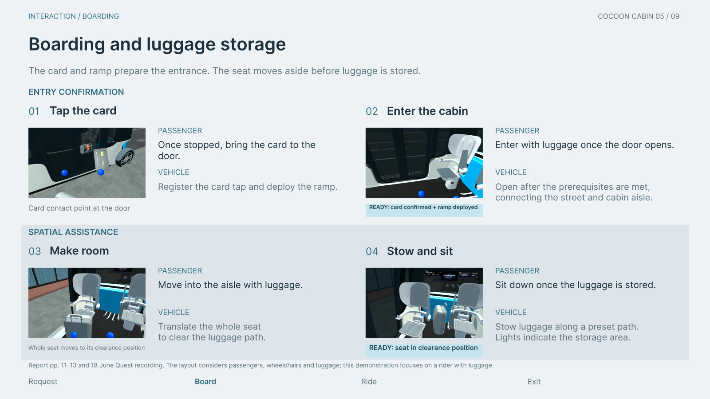
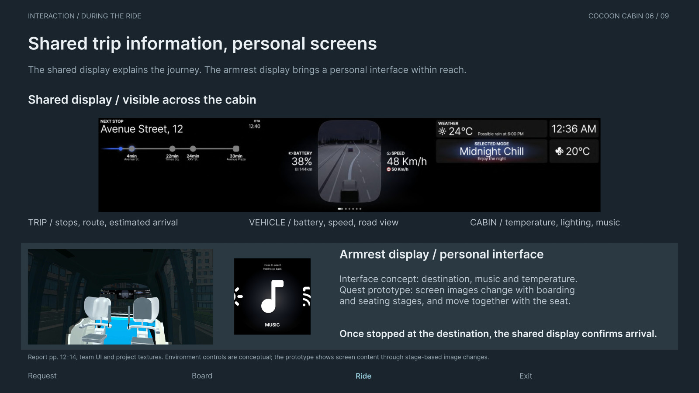
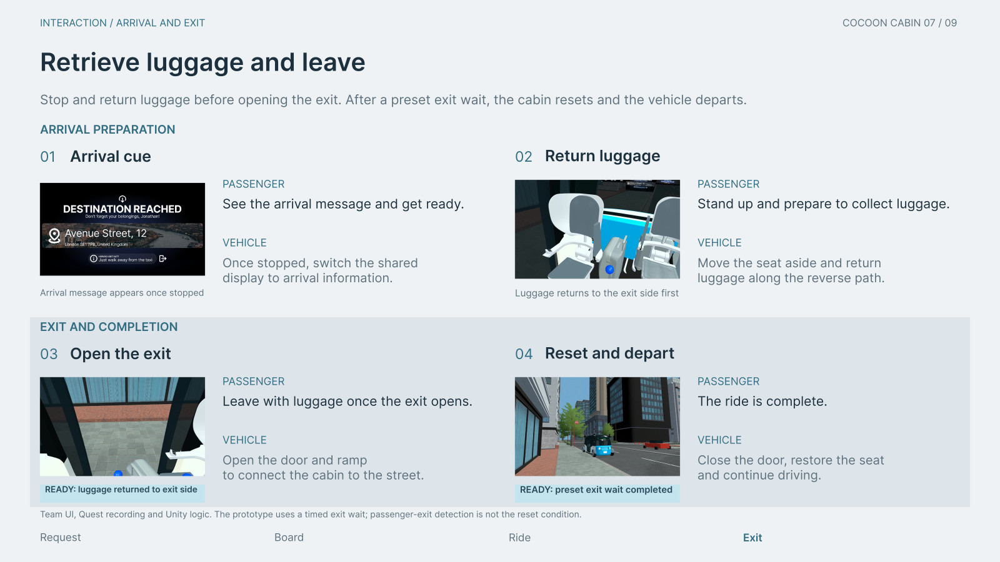
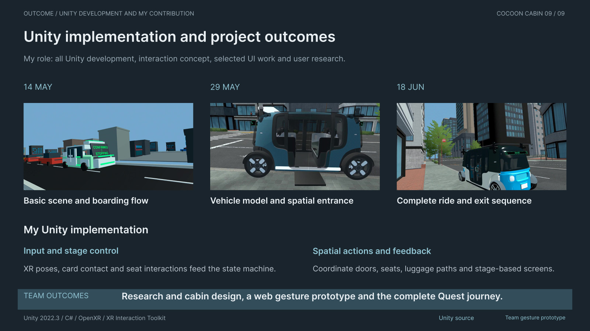

# Cocoon Cabin / English portfolio

Nine pages on gesture interaction, spatial assistance and the complete Unity / Meta Quest passenger journey.

[Download the PDF](Cocoon-Cabin-Portfolio-EN.pdf) · [Editable Figma SVG package](Cocoon-Cabin-Figma-EN.zip) · [English film](https://youtu.be/s00BhWtERXI) · [Chinese film](https://youtu.be/bH3W_9BMuKw)

## 01 / Cocoon Cabin

## 02 / Research and design priorities

## 03 / The complete passenger journey

## 04 / A two-step gesture request

## 05 / Boarding and luggage storage

## 06 / Shared trip information, personal screens

## 07 / Retrieve luggage and leave

## 08 / Prototyping workflow and technology

## 09 / Unity implementation and project outcomes

## Edit in Figma

The [SVG package](Cocoon-Cabin-Figma-EN.zip) contains nine **2560 × 1440** pages. Each SVG directly embeds its **3840 × 2160 PNG** background. The titles, copy, labels and captions remain native `text` / `tspan` objects: **245 editable text objects** across the case study.

Install [Inter Regular and SemiBold](https://rsms.me/inter/), unzip the package and drag the desired SVG into Figma. The background already carries its 4K pixels inside the 2K canvas; no separate image placement is needed. Original evidence screenshots inside that background remain raster images.

The PDF contains searchable English text. The export has been rendered and checked; it has not been imported into Figma during this publication pass.
